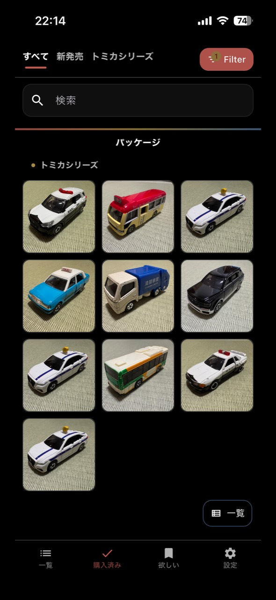
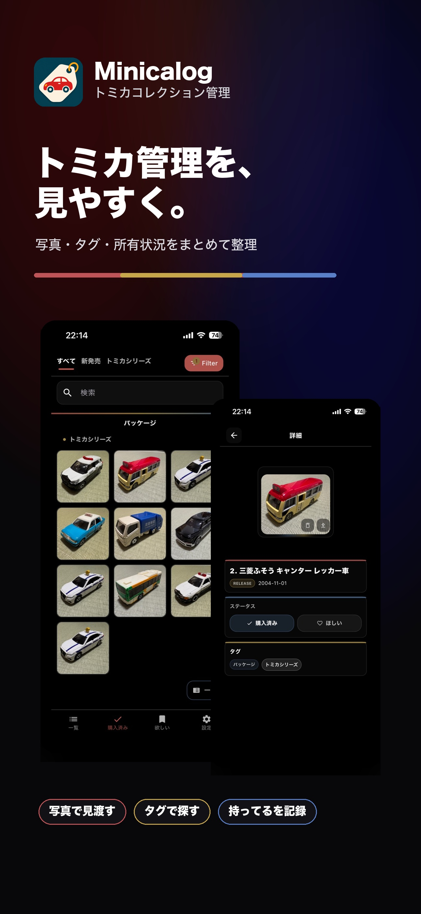
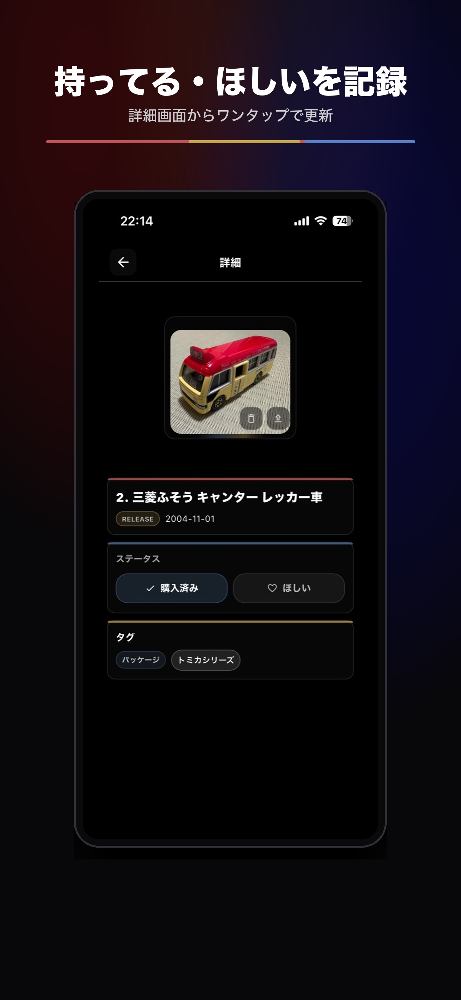
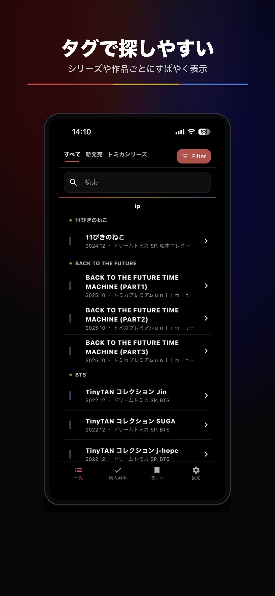
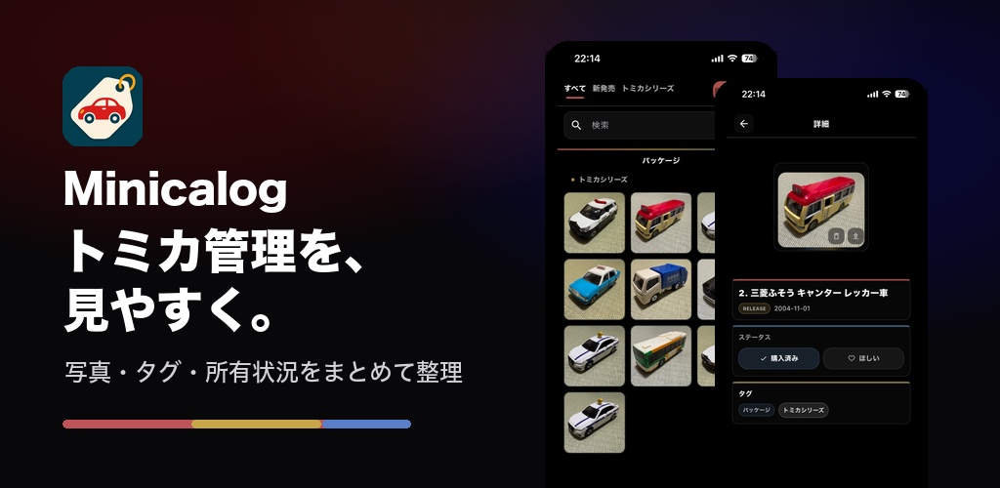
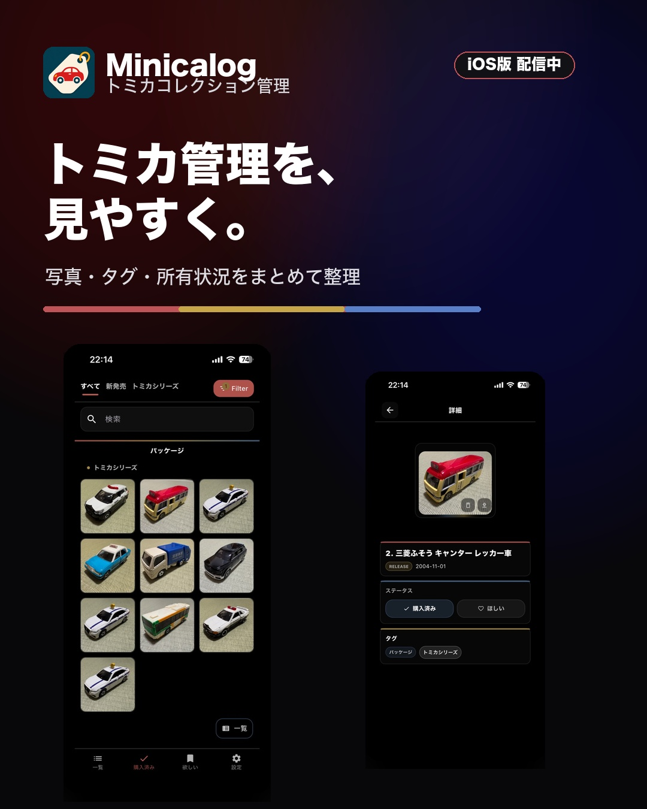

# Minicalog case study

This example shows how the Game Store Image Maker workflow turns real app captures into a coherent store narrative without inventing product behavior.

Minicalog is a collection-management app for recording owned and wanted Tomica items, browsing photo collections, and finding items through tags and saved filters. The source material and selected exports came from the maintainer's `app_007` project.

## The first-three sequence

| Role | Source of truth | Promise | Selected result |
| --- | --- | --- | --- |
| Hook | Collection grid | トミカ管理を、見やすく。 | [`01-hook.jpg`](./exports/app-store/01-hook.jpg) |
| Core loop | Item detail | 持ってる・ほしいを記録 | [`02-core-loop.jpg`](./exports/app-store/02-core-loop.jpg) |
| Discovery | Tag list | タグで探しやすい | [`03-tags.jpg`](./exports/app-store/03-tags.jpg) |

### Before: real collection screen

### After: App Store hook

### Core loop and discovery

| Record owned / wanted status | Find by tags |
| --- | --- |
|  |  |

### Cross-channel adaptation

| Google Play feature graphic | Instagram feed |
| --- | --- |
|  |  |

## Traceability

- [`materials/brief.md`](./materials/brief.md): product truth and supported claims
- [`materials/asset-inventory.md`](./materials/asset-inventory.md): source captures and their roles
- [`working/shot-plan.md`](./working/shot-plan.md): sequence decisions
- [`working/copy-bank.md`](./working/copy-bank.md): selected and rejected copy
- [`working/prompt-pack.md`](./working/prompt-pack.md): prompts for future ImageGen revisions
- [`working/qa-notes.md`](./working/qa-notes.md): accuracy and platform review
- [`exports/manifest.md`](./exports/manifest.md): included output files and source mapping

The JPEGs are an immutable documentation snapshot of an already completed project. Any future raster revision in this repository must use ImageGen; if ImageGen is unavailable, stop at the prompt pack.

The images are included to demonstrate this workflow, not as reusable stock assets. See [`ASSET-NOTICE.md`](./ASSET-NOTICE.md).
